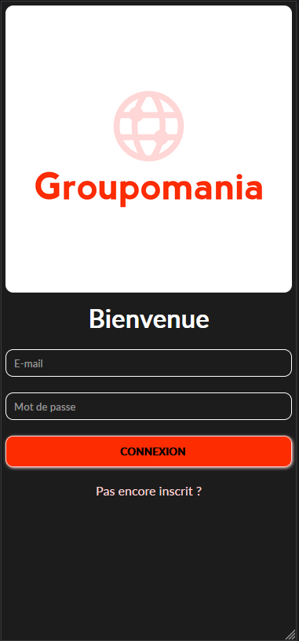
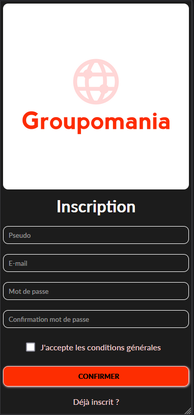
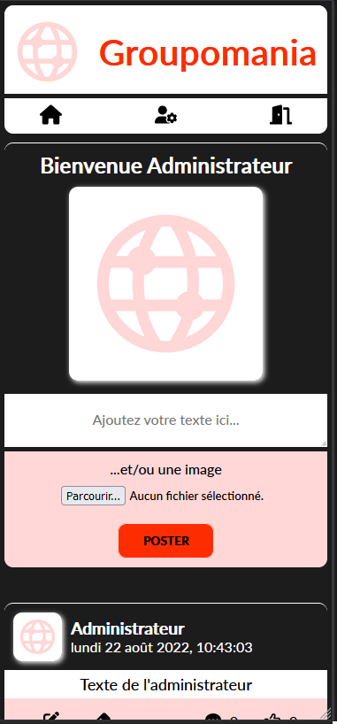
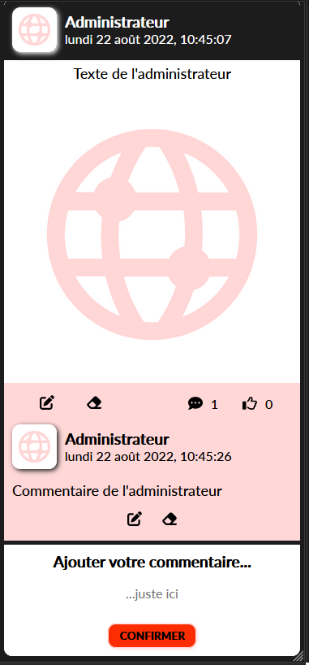
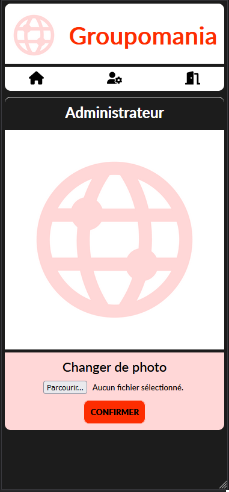

<h1>Groupomania, le reseau social d'entreprise</h1>

<h2>Tehno</h2>
<ul>
<li>NodeJs</li>
<li>MongoDB</li>
<li>Express</li>
<li>React</li>
<li>Redux</li>
<li>Sass</li>
</ul>

<h2>Installation</h2>

<h3>Backend</h3>

Dans <b>backend/config/</b> créer un fichier <b>".env"</b> et ajouter ceci:

<ul>
<li>PORT= <em>votre port localhost pour votre Backend</em></li>
<li>FRONTEND_URL=http://localhost:3000 <em>votre URL Frontend</em></li>
<li>DB_USER= <em>votre identifiant MongoDB</em></li>
<li>DB_PASSWORD= <em>votre mot de passe MongoDB</em></li>
<li>DB_LINK= <em>votre cluster MongoDB</em></li>
<li>TOKEN_SECRET=abcdefghijklmnopqrstuvwxyz01234567899876543210zyxwvutsrqponmlkjihgfedcba <em>votre clé secrète</em></li>
</ul>

Ensuite dans <b>backend/</b> créer un dossier <b>"img"</b> afin de stocker les images de posts et de profils.

Puis à partir de la <b>racine du projet</b> et dans le <b>terminal</b>, <b>cd backend npm install</b>

<h3>Frontend</h3>

Dans <b>frontend/</b> créez un fichier <b>".env"</b> et ajouter ceci:

<ul>
<li>REACT_APP_API_URL=http://localhost:5000/ <em>votre URL Backend</em></li>
</ul>

Puis à partir de la <b>racine du projet</b> et dans le <b>terminal</b>, <b>cd frontend npm install</b>

<h2>Demarrage</h2>

A partir de la racine du projet:

<ul>
<li>Backend : <b>cd backend npm start</b></li>
<li>Frontend : <b>cd frontend npm start</b></li>
</ul>

